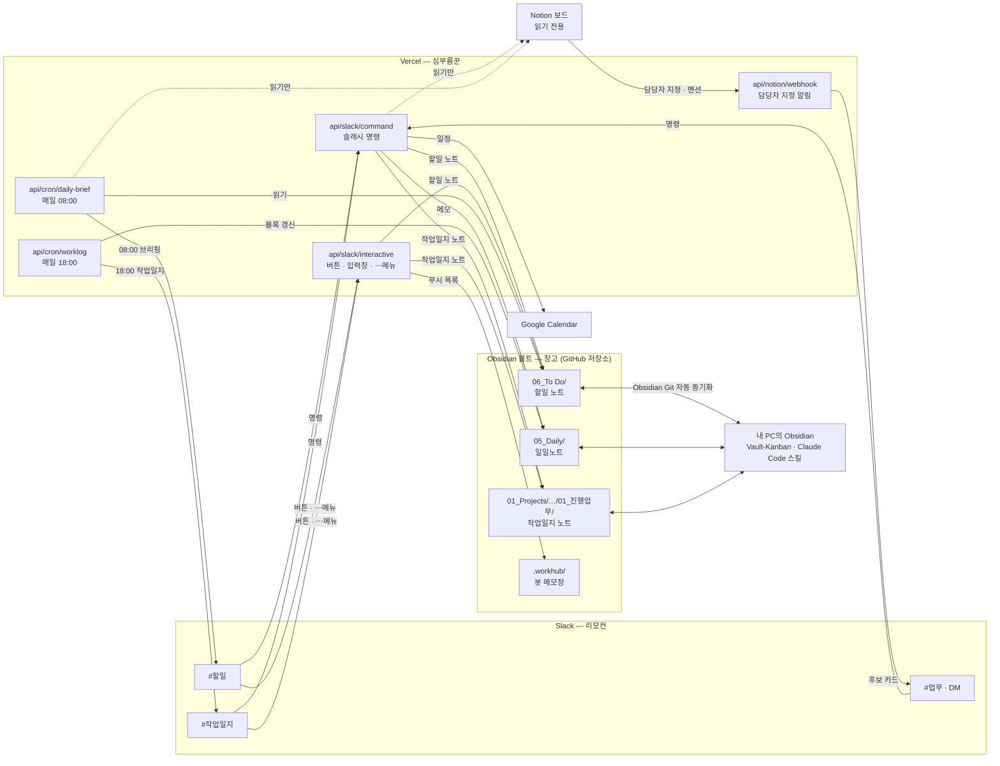
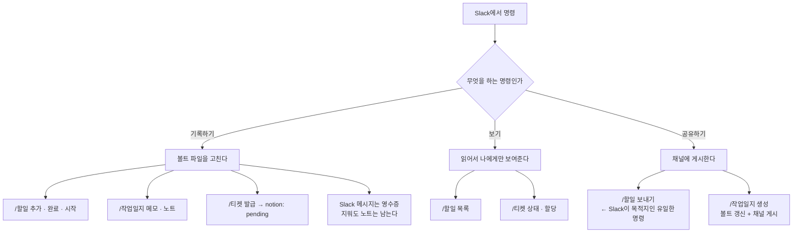
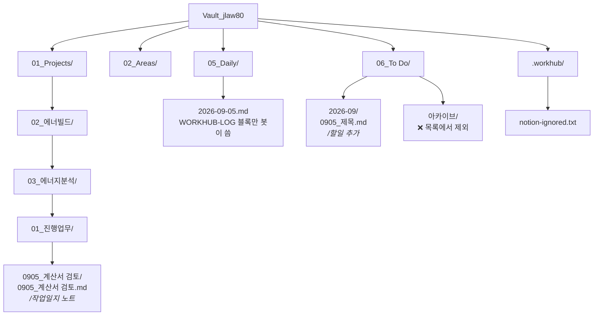
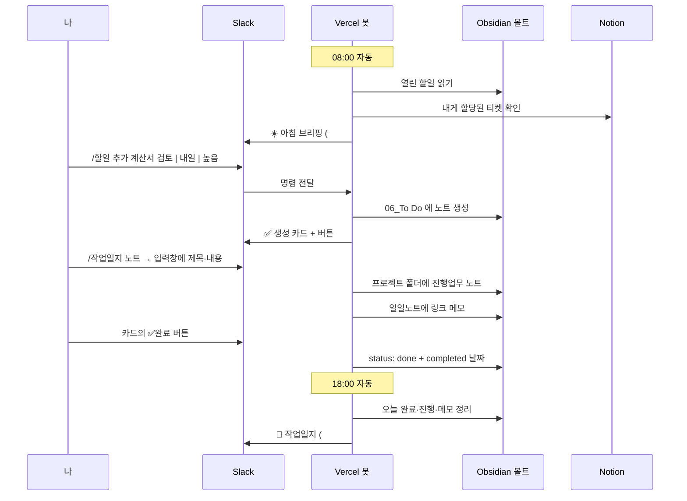

# WorkHub 전체 구조

Slack에서 할일·작업일지·일정을 다루면 그 결과가 **Obsidian 볼트**에 파일로 쌓이는 구조입니다.
이 문서 하나만 읽으면 "무엇이 어디에 저장되고, 왜 그렇게 만들었는지"를 알 수 있게 썼습니다.
설치 순서는 [SETUP.md](SETUP.md)에 따로 있습니다.

---

## 1. 한 문장 요약

> **창고는 Obsidian 볼트, 리모컨은 Slack, 심부름꾼은 Vercel.**

Slack은 입력하고 확인하는 화면일 뿐입니다. 진짜 기록은 전부 볼트의 `.md` 파일로 남습니다.
Slack 메시지를 지워도, 봇을 꺼도, 작업 기록은 그대로 남아 있습니다.

---

## 2. 등장인물 넷

| 이름 | 역할 | 비유 |
|---|---|---|
| **Obsidian 볼트** (GitHub 저장소) | 모든 기록의 원본 | 창고 |
| **Slack** | 명령 입력 + 결과 확인 | 리모컨 |
| **Vercel** | 명령을 받아 볼트를 고치는 서버 | 심부름꾼 |
| **Notion / Google Calendar** | 곁다리 접점 (선택) | 거래처 |

### 볼트가 창고인 이유

노션이나 Slack을 창고로 삼으면 그 서비스가 바뀌거나 끊기는 순간 기록이 인질이 됩니다.
볼트는 내 PC의 그냥 텍스트 파일이라 Obsidian, Vault-Kanban 앱, Claude Code 스킬,
이 봇이 **모두 같은 파일**을 봅니다. 어느 하나가 사라져도 나머지는 그대로 동작합니다.

---

## 3. 그림

### 3-1. 전체 배치



핵심은 화살표 방향입니다. **Slack에서 들어온 명령은 결국 볼트로 흘러갑니다.**
Notion으로 가는 화살표만 점선(읽기 전용)이고, 볼트와 내 PC 사이는 양방향입니다.

### 3-2. 명령이 어디에서 끝나는가



### 3-3. 볼트 폴더



### 3-4. 하루 흐름



> Mermaid 그림은 Obsidian과 GitHub에서 그대로 그려집니다.
> 글자로만 보고 싶으면 아래 배치도를 보세요.

```
 Slack (리모컨)                              Vercel (심부름꾼)
 ┌──────────────┐  /할일 /작업일지 /일정 /티켓  ┌──────────────────────┐
 │ #할일        │ ─────────────────────────▶ │ api/slack/command    │ 슬래시 명령
 │ #작업일지    │ ◀───────────────────────── │ api/slack/interactive│ 버튼·입력창·⋯메뉴
 │ #업무 (+DM)  │ ◀───────────────────────── │ api/cron/daily-brief │ 08:00 아침 브리핑
 └──────────────┘                            │ api/cron/worklog     │ 18:00 작업일지 정리
                                             │ api/notion/webhook   │ ◀── Notion 담당자 지정
                                             └──────┬────────┬──────┘
                                                    │        │
       ┌────────────────────────────────────────────┘        └──────────────┐
       ▼                                                                    ▼
 【창고】 Obsidian 볼트 = GitHub 저장소                              Google Calendar (선택)
   06_To Do/…            할일 노트                                    · due → 종일 일정
   05_Daily/…            일일노트 (봇 전용 블록만)                     · /일정 추가 → 시간 일정
   01_Projects/…         프로젝트 진행업무 노트
   .workhub/…            봇의 메모장 (무시 목록 등)
   ▲ Obsidian Git 플러그인이 내 PC ↔ GitHub 자동 동기화

 【읽기 전용】 Notion 에너빌드작업 보드 (선택)
```

**Notion에는 아무것도 쓰지 않습니다.** 읽기만 합니다.

---

## 4. 볼트 안 어디에 무엇이 쌓이나

### `06_To Do/YYYY-MM/MMDD_제목.md` — 할일

`/할일 추가` 로 만들어지는 노트입니다. 형식은 `todo-capture` 스킬과 Vault-Kanban 앱이 쓰는 것과 **완전히 같습니다.**

```yaml
---
project: 에너빌드                 # 필수. 비운 채 만들지 않는다
sub_project: 에너지분석(에너빌드)
priority: high | mid | low
category: action
status: planned | in-progress | review | done | backlog
works:                            # 네이버웍스 등록 여부 (다른 스킬 담당, 봇은 안 건드림)
notion:                           # assigned | registered | pending
notion-url:
notion-status:
tags: []
created: 2026-09-05
updated:
completed:
due:                              # 있으면 Vault-Kanban·캘린더가 읽음
---
## 업무 개요 / ## 출처 / ## 체크리스트
```

> **아카이브 제외** — `아카이브`, `보관함`, `Archive`, `완료`, `템플릿` 같은 이름의 폴더와
> `_` 로 시작하는 폴더는 목록에서 자동으로 빠집니다. 이름이 특이하면 `VAULT_TODO_EXCLUDE` 로 지정합니다.

### `05_Daily/YYYY-MM-DD.md` — 일일노트

봇은 이 파일 안의 **마커 블록 안쪽만** 씁니다.

```markdown
<!-- WORKHUB-LOG:START -->
## 🗂 WorkHub 작업일지 (자동 생성)
### ✅ 완료 / ### 🔄 진행 중 / ### 📅 일정 / ### 📝 메모
<!-- WORKHUB-LOG:END -->
```

블록 **밖**에 직접 쓴 글이나 다른 스킬의 블록은 절대 건드리지 않습니다.

### `01_Projects/<프로젝트>/<서브>/01_진행업무/MMDD_제목/MMDD_제목.md` — 작업일지 노트

`/작업일지 노트` 로 만들어지는 정식 기록입니다. 제목·내용의 낱말을 보고 프로젝트를 판단해
해당 폴더에 넣습니다. **폴더를 새로 만들지는 않습니다** — 볼트에 이미 있는 `01_진행업무` 폴더 안에만 씁니다.

| 프로젝트 | 볼트 폴더 |
|---|---|
| 신재생에너지제안(EPC) | `01_Projects/01_신재생에너지검토제안(EPC)/` |
| 에너빌드 | `01_Projects/02_에너빌드/` |
| 분산자원통합운영플랫폼 | `01_Projects/03_분산자원통합운영플랫폼/` |
| 연료전지급탕패키지 | `01_Projects/10_연료전지급탕패키지/` |
| BIPV특허기획 | `01_Projects/11_BIPV화재진단기술/` |
| ESS사업(스탠다드에너지) | `01_Projects/12_ESS사업(스탠다드에너지)/` |
| 에너지노관리 | `02_Areas/10_에너지노행정관련/` |

### `.workhub/` — 봇의 메모장

`notion-ignored.txt` (할일로 등록하지 않기로 한 Notion 티켓 ID) 등. 사람이 볼 일은 거의 없습니다.

---

## 5. 명령이 어디로 가는가

세 종류로 갈립니다. **Slack은 대부분 목적지가 아니라 영수증입니다.**

| 명령 | 실제 저장되는 곳 | Slack에는 |
|---|---|---|
| `/할일 추가` | **볼트** 할일 노트 생성 (+캘린더) | 채널에 카드 |
| `/할일 완료·시작·검토·보류` | **볼트** 노트의 `status` 수정 | 채널에 결과 |
| `/작업일지 한 줄` | **볼트** 일일노트 메모 | 채널에 결과 |
| `/작업일지 노트` | **볼트** 프로젝트 진행업무 노트 | 채널에 결과 |
| `/작업일지 생성` | **볼트** 일일노트 블록 갱신 | #작업일지에 게시 |
| `/일정 추가` | **Google Calendar** | 채널에 결과 |
| `/티켓 발급` | **볼트** 노트에 `notion: pending` | 채널에 결과 |
| `/할일 목록` | 저장 없음 (읽기만) | 나만 보임 |
| `/할일 보내기` | 저장 없음 (읽기만) | **채널에 남음** ← Slack이 목적지 |
| `/티켓 상태`·`/티켓 할당` | Notion 읽기만 | 나만 보임 |

`/할일 보내기` 만 예외적으로 "Slack에 게시하는 것" 자체가 목적입니다.
단, 게시된 카드의 ✅완료 버튼을 누르면 그건 다시 볼트를 고칩니다.

### 입력 방법 세 가지

1. **슬래시 명령** — 한 줄짜리 입력. Slack은 `/` 명령에 줄바꿈을 허용하지 않습니다.
2. **입력 창(모달)** — `/작업일지 노트` 처럼 여러 줄이 필요할 때.
3. **메시지 `⋯` 메뉴** — 이미 채널에 쓴 글을 옮길 때. `작업일지로 보내기` / `프로젝트 노트로 저장`.

---

## 6. 자동으로 도는 것

| 시각 (KST) | 하는 일 | 결과 |
|---|---|---|
| 08:00 | 아침 브리핑 — 오늘 일정, 지연/오늘/이번주 할일, Notion 후보, 티켓 상태 변화 | #할일 |
| 18:00 | 작업일지 정리 — 오늘 완료·진행·일정·메모 | 일일노트 + #작업일지 |
| 수시 | Notion 담당자 지정·댓글 멘션 감지 | 후보 카드 → 등록/무시 버튼 |

Vercel 무료 플랜의 크론 한도(2개) 안에서 돕니다. 시간은 `vercel.json` 에서 UTC로 바꿉니다(KST − 9시간).

---

## 7. Notion·캘린더와의 경계

### Notion — 읽기만

Notion은 창고가 아니라 **에너빌드 프로젝트용 스프린트 보드**입니다. 봇이 하는 일은 셋뿐입니다.

1. **할당 감지** — 담당자가 나이거나 댓글에서 멘션되면 Slack에 후보 카드 → `📥 등록` 누르면 볼트에 할일 노트
2. **상태 확인** — `notion-url` 이 있는 노트의 진행 상태를 읽어 `notion-status` 갱신
3. **발급 대기 표시** — `notion: pending` 만 적어 둠

**티켓 발급 자체는 봇이 하지 않습니다.** Claude Code에서 "노션 티켓 발급"이라고 하면
`notion-qa-ticket` 스킬이 `pending` 노트를 찾아 한/영 병기 티켓을 만들고 `notion: registered` + `notion-url` 을 기록합니다.

### Google Calendar — 쓰기 가능

`due` 가 있는 할일은 종일 일정으로, `/일정 추가` 는 시간 일정으로 들어갑니다.

---

## 8. 남의 노트를 망가뜨리지 않기 위한 규칙

이 봇이 지키는 안전장치입니다. 전부 테스트로 검증하고 있습니다.

- **frontmatter만 고친다.** 본문은 읽기만 하고 그대로 둡니다.
- **키 순서를 유지한다.** 모르는 키(`works-url` 같은 것)도 지우지 않고 그대로 둡니다.
- **파일을 옮기거나 지우지 않는다.** 완료는 `status: done` + `completed` 날짜로만 표시합니다.
- **일일노트는 마커 블록 안쪽만** 씁니다.
- **폴더를 임의로 만들지 않는다.** 어디 둘지 모르면 만들지 않고 되묻습니다.
- **같은 이름의 노트를 덮어쓰지 않는다.** `## 진행`에 한 줄 덧붙입니다.
- **Notion에는 쓰지 않는다.**

---

## 9. 코드가 어디에 있나

| 파일 | 하는 일 |
|---|---|
| `api/slack/command.ts` | 슬래시 명령 입구 (서명 검증 → 3초 안에 응답 → 뒤에서 처리) |
| `api/slack/interactive.ts` | 버튼 · 입력 창 저장 · 메시지 `⋯` 메뉴 |
| `api/cron/daily-brief.ts` · `worklog.ts` | 08:00 / 18:00 자동 실행 |
| `api/notion/webhook.ts` | Notion 담당자 지정 알림 |
| `api/health.ts` | 설정 진단 (`?secret=CRON_SECRET`) |
| `src/lib/vault.ts` | **창고 담당** — 노트 읽기·쓰기, frontmatter, 프로젝트 판정 |
| `src/lib/notes.ts` | 프로젝트 폴더 판정, 진행업무 노트 |
| `src/lib/commands.ts` | 명령 해석과 실행 |
| `src/lib/slack.ts` | Slack API, 카드·버튼·입력 창 |
| `src/lib/github.ts` | 볼트(=GitHub) 파일 접근 |
| `src/lib/notion.ts` · `notion-sync.ts` | Notion 읽기 |
| `src/lib/gcal.ts` | Google Calendar |

---

## 10. 뭔가 이상할 때

| 증상 | 먼저 볼 것 |
|---|---|
| Slack에서 "유효한 명령어가 아닙니다" | Slack 앱에 그 명령이 등록됐는지 → 등록 후 **Reinstall to Workspace** |
| 명령은 되는데 볼트에 반영이 안 됨 | Obsidian Git 플러그인이 커밋·푸시했는지 (봇은 GitHub만 봅니다) |
| 할일 개수가 실제와 다름 | 아카이브 폴더 이름, `status` 값, 동기화 시점 |
| 서명 검증 실패 | Vercel의 `SLACK_SIGNING_SECRET` 이 **그 앱**의 값인지 (앱이 여러 개면 헷갈립니다) |
| 전반 점검 | 브라우저에서 `배포주소/api/health?secret=CRON_SECRET값` |

명령어를 잊었으면 Slack에서 `/할일 도움말 전체`.
